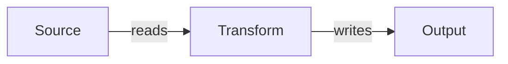

# FlowMap Authoring

FlowMap YAML should be useful even when the Obsidian plugin is not installed. Treat the YAML as a renderer-neutral, evidence-backed system map. The Obsidian plugin is one renderer for that map.

## Default Outputs

When an LLM creates a project map, the default should be to produce all of these:

1. `raw-yaml`: the plain FlowMap YAML object.
2. `obsidian-flowmap-note`: Markdown with one or more fenced `flowmap` blocks.
3. `markdown-summary-plus-yaml`: a short explanation followed by the YAML.
4. `mermaid-fallback`: a Mermaid flowchart that approximates the same nodes and edges.

If the user asks for only one output, produce only that format. Otherwise, produce all formats.

## Evidence Rule

Build FlowMap YAML from actual code and config as they exist in the repository.

Allowed primary evidence:

- Source code.
- Config files, deployment manifests, pipeline files, SQL files, dashboard JSON, tests, scripts, and package metadata.
- Code comments and docstrings only when they explain code/config that exists.

Not primary evidence:

- README files, meeting notes, screenshots, task lists, chats, prior summaries, and issue notes.

Docs and notes can guide inspection and naming, but every node and edge must be justified by code/config evidence. If a contextual system is visible only through configured names, mark it with `data.scope: context-from-config`. If a fact cannot be justified, omit it.

## Recommended Layers

Use multiple maps when one flat diagram hides important detail:

- `system-data-flow`: entrypoints, services, APIs, stores, dashboards, alerts.
- `code-analysis-flow`: functions, transformations, algorithms, intermediate frames, gates, branches.
- `parameters-outputs-alerts`: tunable inputs, table schemas, dashboard queries, alert predicates, local tools.
- `deployment-runtime-flow`: CI/CD, bundle resources, jobs, tasks, secrets, schedules.

## Node Conventions

Use stable slug IDs and human-readable labels.

Use `type` to identify the kind of node:

- `config`
- `runtime-inputs`
- `databricks-job`
- `notebook`
- `external-api`
- `data-ingest`
- `analysis-step`
- `anomaly-detection`
- `delta-table`
- `dashboard`
- `sql-alerts`

Use `detail` for the human explanation of what the step does.

Use `data` for structured facts:

- `scope`: `implemented`, `config`, `external-context`, `context-from-config`, or `implemented-local-tool`.
- `evidence`: file paths that justify the node.
- `functions`, `classes`, `methods`, `symbols`, or `calls`: code symbols.
- `defaults`: runtime defaults.
- `columns`: table/frame columns.
- `table`, `job_key`, `task_key`, `schedule_cron_default`, etc.

`detail` and `data` are not errata. They are where the map becomes useful as a code index.

## Edge Conventions

Edges should represent real relationships found in code/config:

- function calls
- config mapped into runtime parameters
- reads from APIs/tables/files
- writes to APIs/tables/files
- dataframes or payloads passed into downstream functions
- dashboard or alert queries against tables

Do not add an edge only because it sounds like a reasonable architecture. Add it only when code/config supports it.

## Mermaid Fallback

Mermaid fallback should be mechanically derived from the FlowMap nodes and edges. Keep it simple:

Mermaid cannot carry the full `detail`/`data` structure well. Use it as a portable visual fallback, not the source of truth.

## Review Checklist

- Every node has `data.evidence`.
- Every edge can be traced to a call, config mapping, read, write, or query.
- Docs/README claims are not treated as implementation evidence.
- Parameter defaults match code/config exactly.
- Table names and columns match writer/query code.
- External systems are marked as implemented only when code actually calls them.
