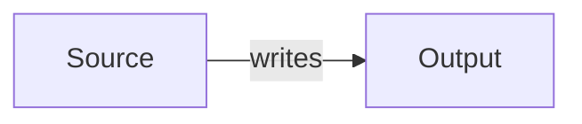

# FlowMap YAML Format

Minimal shape:

```yaml
title: Example
direction: LR
nodes:
  - id: source
    label: Source
    type: input
    detail: Human explanation.
    data:
      scope: implemented
      evidence:
        - src/source.py
edges:
  - from: source
    to: output
    label: writes
```

Top-level fields:

- `title`: display title.
- `direction`: `LR`, `RL`, `TB`, or `BT`.
- `height`: optional canvas height for Obsidian rendering.
- `nodes`: required list.
- `edges`: optional list.
- `layout`: optional positions, usually written by the renderer.

Node fields:

- `id`: stable slug.
- `label`: human label.
- `type`: concise kind such as `config`, `notebook`, `delta-table`, `analysis-step`.
- `detail`: concise human explanation.
- `links`: optional label-to-URL map.
- `data`: structured evidence and facts.

Recommended `data` fields:

- `scope`
- `evidence`
- `functions`
- `classes`
- `methods`
- `symbols`
- `calls`
- `defaults`
- `columns`
- `table`
- `job_key`
- `task_key`
- `schedule_cron_default`

Edge fields:

- `from`: source node id.
- `to`: target node id.
- `label`: short relationship.
- `detail`: optional explanation.
- `data`: optional evidence or relationship facts.

Mermaid fallback:



Mermaid labels should be escaped or simplified. Keep Mermaid as a derived visual fallback; do not use it as the source of truth.
